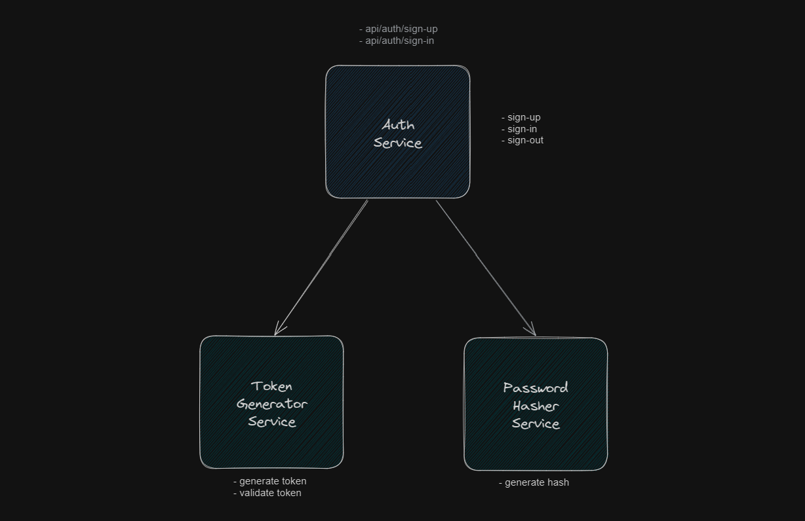

# Simple authentication with JWT

- [project setup](#simple-auth-project-setup)
- [infrastructure](#simple-jwt-authentication-infrastructure)
- [setup step-by-setp](#setup-step-by-step)

### Simple auth project setup

- open project **Identity.Local.Jwt**
- build and run the project
- postman collection [link](https://www.postman.com/max-dev-team/workspace/wow-2-0/folder/16296932-c0c81c8d-6a00-49cf-abc9-f273c683b368?action=share&creator=16296932&ctx=documentation)

### Simple jwt authentication infrastructure



- **AuthService** responsible for
    * signing up the user
    * signing in the user
    * is not responsible for saving or validating the user
- **TokenGeneratorService** responsible for
    * generates user claims
    * generates jwt token
    * validates token
    * is not responsible for saving token
- **PasswordHasherService** - responsible for
    * hashes given password
    * validates raw password with hash
    * is not responsible for updating the password

## Setup step-by-step

### Installation

1. create empty web API project
2. install dependencies
    * BCrypt.Net-Next
    * Microsoft.AspNetCore.Authentication.JwtBearer
3. create **HostConfiguration** and it's extensions for clear host configuration
4. create **JwtAuthSettings** settings model and following example values to **appsettings.json**
    ```
    "JwtAuthSettings" : {
    "ValidateIssuer": false,
    "Issuer": "Test",
    "ValidateAudience": false,
    "Audience": "Test",
    "ValidateLifetime": true,
    "ExpirationTimeInMinutes": 60,
    "ValidateIssuerSigningKey": true,
    "SecretKey": "76FA6456-AE86-44DB-BBBB-0E37713045FD"
    }
    ```
5. create identity infrastructure registration method and register configuration model

### Sign up process

1. create **SignUpDetails** model with sign up information
2. create **PasswordHasherService**
3. create **AuthAggregationService** and inject **PasswordHasherService**
4. create **SignUpAsync** method that does next
   * look up for user if found - throws exception
   * if not creates user from sign up details
   * hashes user password and saves along with user
5. create **AuthController** with default **api/auth** route
6. create sign up action with **api/auth/sign-up** route
7. inject **AuthAggregationService** into controller and call

### Sign in process

1. create **SignInDetails** model with sign up information
2. create **TokenGeneratorService**
3.  inject **PasswordHasherService** into **AuthAggregationService**
4. create **SignInAsync** method that does next
    * look up for user if not found - throws exception
    * if found, validates password
    * creates jwt token and returns it
5. create sign in action with **api/auth/sign-in** route
6. inject **AuthAggregationService** into controller and call